# Secure Software Development - Team RED Project
## Online Retailer

### Application Tools & Libraries
The source code for our online retail application is organised and documented according to Python’s PEP-8 style guide. The interface is via command line, the application is not network deployed.                                                       

The following languages were used in this project,
- Python v3.12.0
- Javascript Object Notation (JSON) v2.10.1

&, the following tools,
- FastAPI v0.103.2
- Uvicorn v0.23.2
- Mkcert v3.1.0
- Chocolatey v2.0.0
- Cryptography fernet v41.0.4

&, the following python modules,
- multipart
- OS
- typing, typing-extensions
- datetime
- sys
- random
- string
- shutil 
- inputimeout

### Initial setup
1. Download the repository from Github
2. Code must be run in VS code on Windows
3. Pre-requisites to install are as follows:
    pip install fastapi uvicorn,
    pip install pydantic,
    pip install python-multipart,
    pip install inputimeout

#### Additional option for SSL
if you wan to use SSL (HTTPS) for the API you will need to generate self certified certificates for local use.
This can be done by installing mkcert through choco.
1. run choco install mkcert
2. run mkcert -install
3. run mkcert localhost 127.0.0.1 ::1

Note delete the exisitng .pem keys in the solution. Any certificate generated will be associated with yourlocal machine. Key will be generated with 'localhost+2.pem' and 'localhost+2-key.pem'.
Update the file names if needed in server.py against the SSL_KEY_FILE and SSL_CERT_FILE.

Fig 1. server.py

###             Executing the CLI application -->
### Set An Administrator Key (Password)
1. Run the adminCreator.py script 'python3 adminCreator.py'
2. When prompted enter an administrator key to set the administrator key (password)

Fig 3. adminCreator.py

### then, Run The Online Shop Application (onlineretailer.py) Program
1. Run the onlineretailer.py script or in terminal, 'python3 onlineretailer.py'
2. Follow the prompts given to access either the user or administrator menu
3. Run the onlineretailer.py script again to re-access the shop if exited

   Upon login and following the prompts you will reach -->

Fig 4. onlineretailer.py

### Executing the API
1. Set SECURE to TRUE in server.py. This will run main.py which is the script that incorporates all the authentication and security features.
2. Set SECURE to FALSE in server.py. This will run mainunsecure.py which is the script that has no authentication or security features.
3. Set SSL to FALSE in server.py. This will run the server with HTTP. SSL set to true will use HTTPS but only with the self signed .pem certificates in the solution.
4. Run 'python server.py' in the terminal
5. Click the link in the terminal window for the URL to the Uvicorn BASE url.
6. Browse to http://localhost:8432/docs or https://localhost:8432/docs if using SSL. (/docs must be added manually to the url in your browser when API runs.)

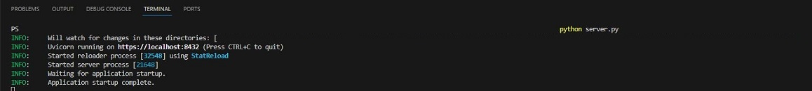

Fig 2. Running server.py in terminal

### Using the API through the FAST API Swagger UI
1. For simplicity use the following credentials:

    | Username          | Password      |
    | -------------     | ------------- |
    | simonbolder       | aJ708/F0M*    |
    | liamwillson       | hd2_rR3~7g    |
    | fergusnugent      | {L9C4\Pz8u    |
    | cathrynpeoples    | 30{Ey2@m`S    |
    | customer1         | 99KVC.9Nom    |
    | supplier1         | £mq6|Xd08v    |

First step is to authorise yourself. Click the Authorise button.

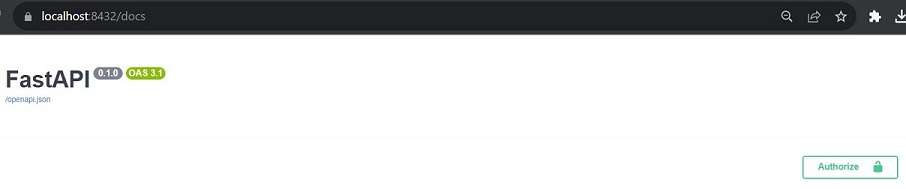

Fig 3. Authorisation

Enter username and password from table above and click authorise.

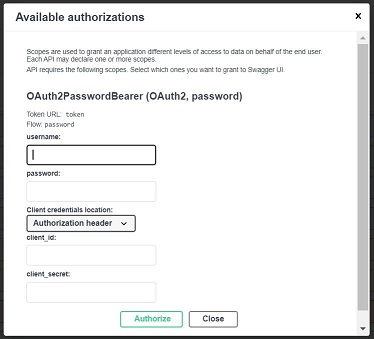

Fig 4. Enter credentials

Click close when authorised.

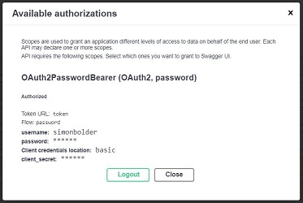

Fig 5. Authorise

Once authenticated you can use any of the following endpoints by clicking on the down arrow next to the padlock (highlighted in yellow):

Fig 6. API home/menu

### General use of the swagger UI when using the API
To execute any of the API endpoints you will need to enter parameters. To do this you will need to expand each API and tehn click the 'Try it out' button to enable the parameters. Once doen and parameters entered click the execute button to run the API function.

### Get API Log
This will require you to input a username parameter. It is the same username as authorisation. Based on the role or disabled state in the API_USERS_DB in main.py will determine if you can execute the API function.

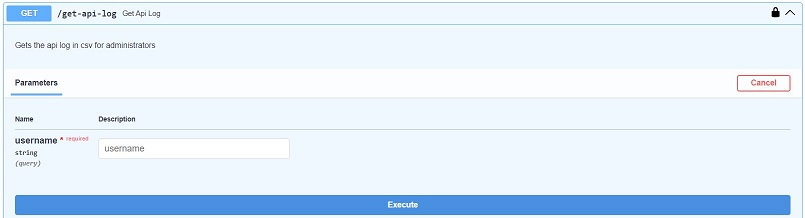

Fig 7. Get API Log

### Get Items
This will require you to input a username parameter. It is the same username as authorisation. Based on the role or disabled state in the API_USERS_DB in main.py will determine if you can execute the API function.

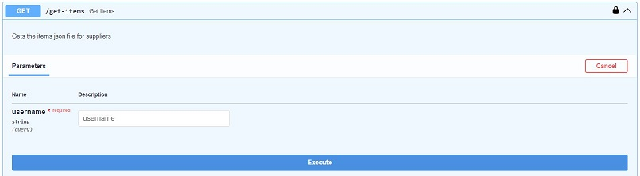

Fig 8. Get Items

### Add Item
This will require you to input a username, item id, item name, item price, item description and item stock as parameters. It is the same username as authorisation. Based on the role or disabled state in the API_USERS_DB in main.py will determine if you can execute the API function. The function will check to see if there is already an item. Use items.json file to test as it should have been populated with data by the onlineretailer.py script.

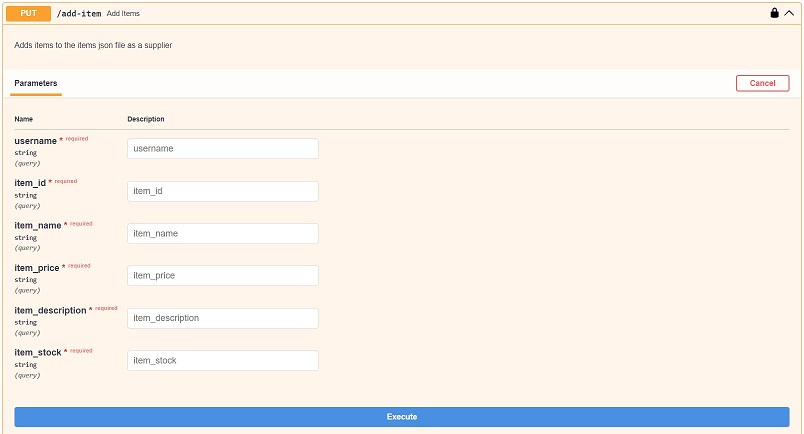

Fig 9. Add Items

### Update Order Quantity
This will require you to input a username, order id and order quantity as parameters. It is the same username as authorisation. Based on the role or disabled state in the API_USERS_DB in main.py will determine if you can execute the API function. The function will check to see if there is already an order with that order id. Use orders.json file to test as it should have been populated with data by the onlineretailer.py script.

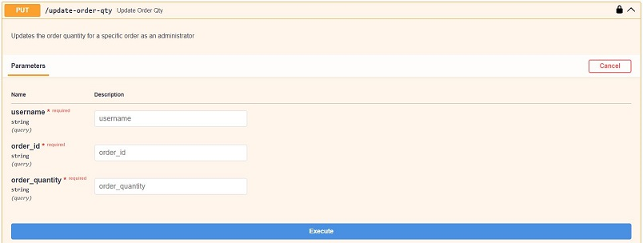

Fig 10. Update Order Quantity

### Delete Order
This will require you to input a username, order id as parameters. It is the same username as authorisation. Based on the role or disabled state in the API_USERS_DB in main.py will determine if you can execute the API function. The function will check to see if there is already an order with that order id. Use orders.json file to test as it should have been populated with data by the onlineretailer.py script.

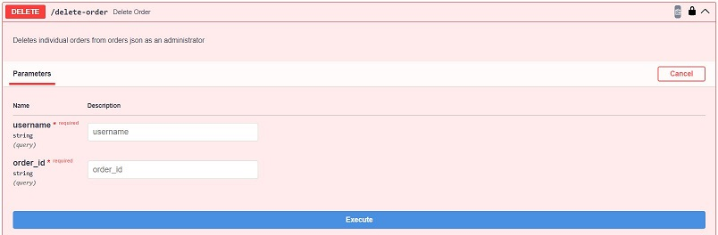

Fig 11. Delete Order

### Upload File
This will require you to input a username and a file selection (object) as parameters. It is the same username as authorisation. Based on the role or disabled state in the API_USERS_DB in main.py will determine if you can execute the API function. The function will check to see if there is already a file with that name in the uploads folder, check for size and file extension.

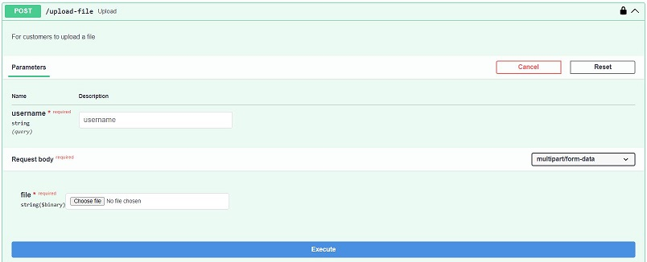

Fig 12. Upload File

### Unsecure API
By setting the SECURE variable to FALSE in server.py this will run mainunsecure.py when server.py is run. This API has the same functions but all authorisation, security and control removed. This would be useful for testing vulnerabilities and is a good representation of exposing an API and backend to potential attackers.

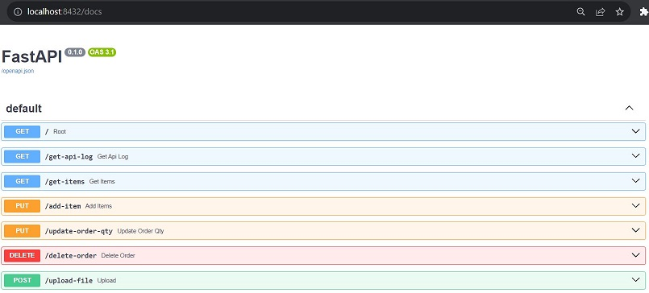

Fig 12. Unsecure API

----------------------------------------------------------------------------------------
### Now, you can explore the online shop and it's functionality by following the prompts it gives... ###
----------------------------------------------------------------------------------------

#### Bibliography

Chocolatey. (2023) Chocolatey Software. Available from: https://chocolatey.org/ [Accessed 18 Oct 2023].

CrypTool-Online. (2023) OpenSSL. Available from: https://www.cryptool.org/en/cto/openssl [Accessed 21 Oct 2023].

JSONLint. (2023) JSONLint Validator and Formatter. Available from: https://jsonlint.com/ [Accessed 21 Oct 2023].

Python Code Quality Authority (PyCQA). (2023) Fernet (symmetric encryption). Available from: https://github.com/pyca/cryptography/blob/main/docs/fernet.rst#fernet-symmetric-encryption [Accessed 18 Oct 2023].

Python Code Quality Authority (PyCQA). (2022) Flake8. Available from: https://github.com/pycqa/flake8/blob/main/docs/source/index.rst [Accessed 18 Oct 2023].

FiloSottile. (2022) mkcert. Available from: https://github.com/FiloSottile/mkcert [Accessed 18 Oct 2023].

Pylint. (2023) pylint 3.0.1. Available from: https://pypi.org/project/pylint/ [Accessed 18 Oct 2023].

Rajshirolkar. (2021) FastAPI over HTTPS for development on Windows. Available from: https://dev.to/rajshirolkar/fastapi-over-https-for-development-on-windows-2p7d [Accessed 21 Oct 2023].

Tiangolo. (2023) FastAPI. Available from: https://fastapi.tiangolo.com/ [Accessed 18 Oct 2023].

Uvicorn. (n.d.) Available from: https://www.uvicorn.org/ [Accessed 18 Oct 2023].
