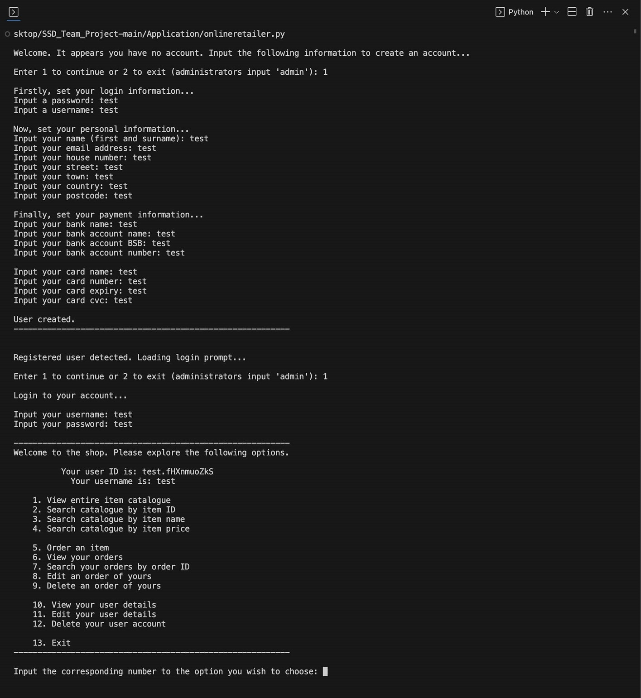

# Secure Software Development - Team RED Project
## Online Retailer

### Initial setup
1. Download the repository from Github
2. Code must be run in VS code on Windows
3. Pre-requisites to install are as follows:
    pip install fastapi uvicorn
    pip install pydantic
    pip install python-multipart

#### Additional option for SSL
if you wan to use SSL (HTTPS) for the API you will need to generate self certified certificates for local use.
This can be done by installing mkcert through choco.
1. run choco install mkcert
2. run mkcert -install
3. run mkcert localhost 127.0.0.1 ::1

Note delete the exisitng .pem keys in the solution. Any certificate generated will be associated with you rlocal machine. Key will be generated with 'localhost+2.pem' and 'localhost+2-key.pem'.
Update the file names if needed in server.py under the if statement for running main.py. Set the SSL variable to true in server.py

Fig1. SSL Server.py

### Executing the CLI application
To add

### Executing the API
1. Set SSL to false in server.py. This will run the server with HTTP. SSL set to tru will use HTTPS but only with the self signed .pem certificates in the solution.
2. Run 'python server.py' in the terminal
3. Click the link in the terminal window for the URL to the Uvicorn BASE url.
4. Browse to http://localhost:8432/docs

### Using the API through the FAST API Swagger UI
1. First step is to authorise yourself. Click the Authorise button and enter credentials out of the API_USERS_DB in main.py
    For simplicity use the following credentials:

    | Username          | Password      |
    | -------------     | ------------- |
    | simonbolder       | aJ708/F0M*    |
    | liamwillson       | hd2_rR3~7g    |
    | fergusnugent      | {L9C4\Pz8u    |
    | cathrynpeoples    | 30{Ey2@m`S    |
    | customer1         | 99KVC.9Nom    |
    | supplier1         | £mq6|Xd08v    |

2. Once authenticated you can use any of the following endpoints:

Fig1. API home

### Token Login
To add detail

### Get System Log
To add detail

### Get API Log
To add detail

### Set An Administrator Key (Password)
1. Run the adminCreator.py script 'python3 adminCreator.py'
2. When prompted enter an administrator key to set the administrator key (password)

### Finally, Run The Online Shop Application (onlineretailer.py) Program
1. Run the onlineretailer.py script or in terminal, 'python3 onlineretailer.py'
2. Follow the prompts given to access either the user or administrator menu
3. Run the onlineretailer.py script again to re-access the shop if exited

   Upon login and following the prompts you will reach -->

----------------------------------------------------------------------------------------
### Explore the online shop and it's functionality by following the prompts given... ###
----------------------------------------------------------------------------------------

References:
https://www.cryptool.org/en/cto/openssl
https://dev.to/rajshirolkar/fastapi-over-https-for-development-on-windows-2p7d
https://www.cryptool.org/en/cto/openssl
https://fastapi.tiangolo.com/
https://jsonlint.com/
